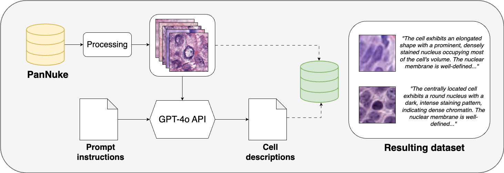
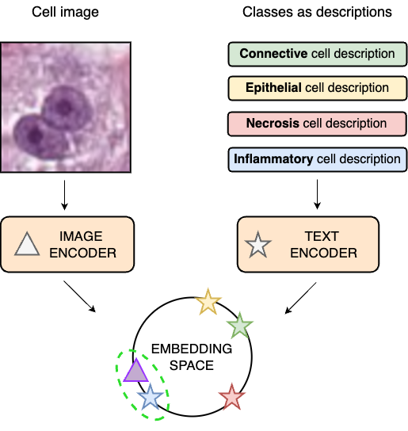

# Zero-Shot Cell Classification in Histopathology Images using CONCH

This repository contains the code for the research conducted in my Master's thesis, "**Zero-Shot Cell Classification for Digital Pathology Image Analysis**".

This project explores the application of the CONCH vision-language model to perform zero-shot classification of individual cells within histopathology images. The goal is to demonstrate the potential of pre-trained vision-language models to reduce the reliance on large, manually-annotated datasets, a significant bottleneck in computational pathology. This work addresses a key limitation of CONCH, exploring its application to cell scale.

Histopathology, the microscopic examination of tissue, is crucial for diagnosing diseases like cancer.  Identifying and classifying individual cells within tissue samples is a fundamental task, but it's traditionally labor-intensive and requires expert pathologists.  Deep learning offers promising solutions, but these models typically require vast amounts of labeled data, which are expensive and time-consuming to acquire.

In this research we investigate a **zero-shot learning** approach using [CONCH (Contrastive Learning from Captions for Histopathology)](https://github.com/Mahmoodlab/CONCH), a vision-language model pre-trained on a large dataset of histopathology image-caption pairs.  We evaluate whether CONCH, without any *cell-specific* training, can accurately classify individual cells based solely on textual descriptions of their morphological features. We also explore **fine-tuning** strategies to improve performance. We use the [PanNuke](https://warwick.ac.uk/fac/cross_fac/tia/data/pannuke) and [PUMA](https://puma.grand-challenge.org/dataset/) for evaluation and inflammatory cell sub-classification, respectively.

## Installation

First, clone the repository and navigate into the directory:
```bash
git clone https://github.com/madavins/ZS-cell-classification.git
cd ZS-cell-classification
```
Next, create a virtual environment and install the dependencies:
```bash
python3 -m venv .venv
source .venv/bin/activate
pip install -r requirements.txt
```
**Note:** The `conch` package is installed directly from the GitHub repository:
```bash
pip install "conch @ git+https://github.com/Mahmoodlab/CONCH.git"
```

Additionally, you'll need to download the CONCH model weights from the [Hugging Face model hub](https://huggingface.co/MahmoodLab/CONCH).

## Data preparation

This project uses the PanNuke and PUMA datasets.

1.  **Download datasets:**

    *   **PanNuke:** Download from [PanNuke Dataset](https://warwick.ac.uk/fac/cross_fac/tia/data/pannuke).
    *   **PUMA:** Download from [PUMA Dataset](https://puma.grand-challenge.org/dataset/).

2.  **Organize data:** Create the following directory structure:

    ```
    data/
        pannuke/
            images/
            annotations.json
        puma/
            images/
            annotations.json
    ```
    PanNuke and PUMA data have to be in COCO format and placed into their respective folders.

3.  **Create cell centered crops:** Use the `prepare_crops.py` script to extract 112x112 pixel crops centered on each cell nucleus from PanNuke or PUMA patches.

    ```bash
    python data/prepare_crops.py --input_folder data/pannuke --output_folder data/pannuke_crops
    python data/prepare_crops.py --input_folder data/puma --output_folder data/puma_crops
    ```

4.  **(Optional - for fine-tuning) Generate fine-tuning dataset:**  This step requires an OpenAI API key. Set the `OPENAI_API_KEY` environment variable, and then run the `dataset_processor.py` script:

    ```bash
    export OPENAI_API_KEY="your_openai_api_key"
    python openai_api/dataset_processor.py \
        data/pannuke_crops/annotations.json \
        data/pannuke_crops/images \
        data/pannuke_crops/subset_annotations.json \
        data/pannuke_crops/finetuning_annotations.json
    ```
    **Note:** This step uses the OpenAI API and will incur costs.

    <div align="center">
        
        <p><em>Pipeline for creating the fine-tuning dataset. The process involves selecting a subset of cell images, generating descriptions using GPT-4, and creating image-text pairs for model fine-tuning.</em></p>
    </div>

## Usage

### Zero-shot classification

To perform zero-shot cell classification, use the `zero_shot.py` script and the provided `zero_shot.yaml` configuration file.

1.  **Edit `zero_shot.yaml`:** Modify the paths in `zero_shot.yaml` to point to your CONCH checkpoint, fine-tuned checkpoint (if applicable), dataset directories, and description files.

2.  **Run the evaluation:**

    ```bash
    python zero_shot.py --config zero_shot.yaml --experiment_name <your_experiment_name> --output_dir <your_output_directory>
    ```

    *   `--config`: Specifies the configuration file.
    *   `--experiment_name`:  A name for your experiment (used for output file naming).
    *   `--output_dir`:  The directory where results (JSON file and confusion matrix) will be saved.

    <div align="center">
        
        <p><em>Overview of the zero-shot cell classification process. The CONCH model compares cell image embeddings with text embeddings of cell descriptions to perform classification without cell-specific training.</em></p>
    </div>

### Fine-tuning

To fine-tune the CONCH model on the generated dataset of cell image and description pairs:

1.  **Edit `finetuning/configs/finetune.yaml`:**  Modify the paths to point to your CONCH checkpoint, training data, and desired output locations.  Choose the fine-tuning `stage`.

2.  **Run fine-tuning:**

    ```bash
    python finetuning/train.py --config finetuning/configs/finetune.yaml
    ````

## License
**To be compelted**

## Citation
**To be completed**